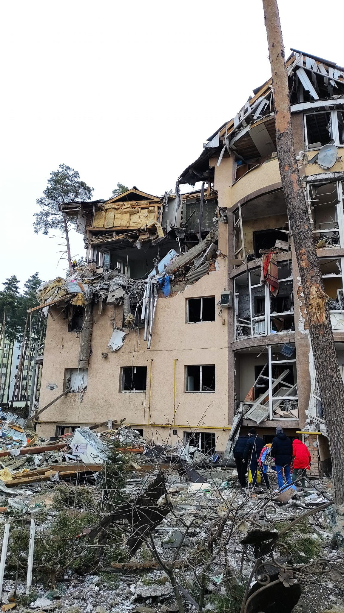

# swift-everywhere-samples

## My Town

This Open source project won't be updated until Kremlin will stop war in Ukraine and repair damages made in towns: Irpin, Bucha, Gostomel. If this won't happen during next 6 months (until 1 September 2022), then this project will be removed from public space.



See also:

- [Russian invaders bomb high-rise building in Irpin west of Kyiv](https://www.pravda.com.ua/eng/news/2022/03/2/7327381/)
- [In the morning, the invaders launched two air strikes on Irpin, a residential building was destroyed](https://gordonua.com/news/war/utrom-okkupanty-nanesli-dva-aviaudara-po-irpenyu-razrushen-zhiloy-dom-foto-i-video-1598067.html)

## Requirements

- macOS 11.x
- Xcode 12.x
- Android Studio 2020.3.x

## Usage

1. Make sure that you have [Swift Android Toolchain](https://github.com/vgorloff/swift-everywhere-toolchain). You can either build it or download [pre-build](https://github.com/vgorloff/swift-everywhere-toolchain/releases) version.

2. Reveal the NDK version inside file `NDK_VERSION`, which located at the root of the Swift Toolchain you downloaded or built on step 1.

3. Make sure that you have a symlink at `/usr/local/ndk/$NDK_VERSION` to appropriate NDK bundle. Where `$NDK_VERSION` is the NDK version from file `NDK_VERSION` you viewed on step 2.

   ```sh
   sudo mkdir -p /usr/local/ndk
   sudo ln -vsi ~/Library/Android/sdk/ndk/21.X.YYYZZZ /usr/local/ndk/21.X.YYYZZZ
   ```

4. Make sure that NDK version defined in Gradle build configuration file (See: `Android/app/build.gradle`) in property `android.ndkVersion` matches NDK version from file you viewed on step 2. Update property `android.ndkVersion` if needed.

5. Make sure that the absolute paths to NDK headers in sources matching NDK version inside file `NDK_VERSION`.

6. Copy file `example.swiftToolchain.rc` to `swiftToolchain.rc`. Update file `swiftToolchain.rc` with proper paths:

   - `SaSwiftToolchainDirPath` - Path to Swift Toolchain you downloaded or built on step 1.

7. Install "Protocol buffers" for Java and Swift sources generation `brew install protobuf swift-protobuf`

8. (Optional) Generate models: `Scripts/GenerateModels.sh`

9. Open `iOS/HelloJNI.xcodeproj` in Xcode and run it on Device or iOS Simulator.

10. Open folder `Android` in Android Studio and run it on Device or Android Simulator.
